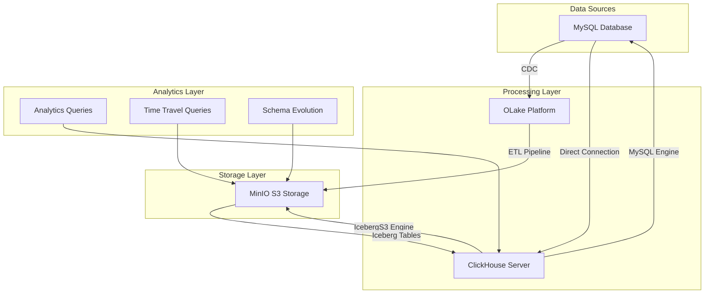

# ClickHouse + MySQL + OLake + Iceberg Data Lakehouse Demo

A comprehensive Docker-based development environment showcasing ClickHouse's experimental Iceberg write support integrated with MySQL as a source database and OLake as a data lake orchestration platform. This setup demonstrates modern data lakehouse architecture with real-time CDC capabilities.

## 🏗️ Architecture Overview



## 🎯 What This Demo Showcases

### Core Features
- **ClickHouse Experimental Iceberg Write Support** - Create, insert, update, and query Iceberg tables
- **Real-time CDC Pipeline** - MySQL → OLake → Iceberg with change data capture
- **Cross-Database Analytics** - Query MySQL and Iceberg data simultaneously
- **Schema Evolution** - Add columns and modify schemas without data loss
- **Time Travel Queries** - Query historical data states
- **Partition Pruning** - Optimized query performance with intelligent partitioning

### Integration Components
- **MySQL 8.0** - Source database with sample e-commerce data
- **ClickHouse 24.11** - Analytics database with experimental Iceberg support
- **MinIO** - S3-compatible object storage for Iceberg tables
- **OLake** - Data lake orchestration and CDC platform
- **PostgreSQL** - Metadata store for OLake

## 🚀 Quick Start

### Prerequisites
- Docker and Docker Compose installed
- At least 8GB RAM available
- 10GB free disk space

### One-Command Setup
```bash
git clone <this-repo>
cd clickhouse-mysql-olake-demo
./scripts/setup.sh
```

This will:
1. Start all services via Docker Compose
2. Initialize MySQL with sample data
3. Configure ClickHouse with Iceberg experimental features
4. Set up MinIO buckets for Iceberg storage
5. Run comprehensive demo queries
6. Display service URLs and access information

## 📊 Sample Data

The demo includes realistic e-commerce data:

### Tables
- **users** (20+ users) - Customer information with demographics
- **products** (25+ products) - Product catalog across multiple categories
- **orders** (30+ orders) - Purchase history with various statuses
- **user_sessions** (15+ sessions) - User activity tracking

### Geographic Distribution
- USA, Canada, UK, Germany, France, Spain, Japan, India, Australia, Norway, Brazil, Mexico, Singapore

### Product Categories
- Electronics, Gaming, Software, Home, Health, Books, Education, Accessories, Furniture

## 🔧 Service Details

### ClickHouse Server
- **HTTP Interface**: http://localhost:8123
- **Native Interface**: localhost:9000
- **MySQL Protocol**: localhost:9004
- **Credentials**: default user (no password)

#### Key Configuration
```xml
<allow_experimental_insert_into_iceberg>1</allow_experimental_insert_into_iceberg>
<use_iceberg_partition_pruning>1</use_iceberg_partition_pruning>
<use_iceberg_metadata_files_cache>1</use_iceberg_metadata_files_cache>
```

### MySQL Database
- **Connection**: mysql://localhost:3306
- **Database**: demo_db
- **Credentials**: demo_user / demo_password
- **CDC User**: olake / olake_pass (for replication)

#### Features Enabled
- Binary logging (ROW format)
- GTID mode for reliable replication
- Multiple users for different access patterns

### MinIO S3 Storage
- **Console**: http://localhost:9091
- **API**: http://localhost:9090
- **Credentials**: minioadmin / minioadmin123
- **Buckets**: iceberg-warehouse, olake-data

### OLake Platform
- **UI**: http://localhost:8000
- **Credentials**: admin / password
- **Backend**: PostgreSQL (localhost:5432)

## 📝 Demo Scenarios

### 1. Basic Integration Testing
```sql
-- Test ClickHouse → MySQL connectivity
SELECT * FROM mysql_users LIMIT 5;

-- Create Iceberg table
CREATE TABLE iceberg_users_demo (
    id Int32,
    username String,
    email String,
    created_at DateTime
) ENGINE = IcebergS3('http://minio:9000/iceberg-warehouse/demo/', 'minioadmin', 'minioadmin123');

-- Insert data
INSERT INTO iceberg_users_demo SELECT id, username, email, created_at FROM mysql_users;
```

### 2. Schema Evolution Testing
```sql
-- Add new column
ALTER TABLE iceberg_users ADD COLUMN last_login DateTime;

-- Update existing records
ALTER TABLE iceberg_users UPDATE last_login = now() WHERE id <= 5;

-- Verify schema evolution
DESCRIBE iceberg_users;
```

### 3. Time Travel Queries
```sql
-- Query data at specific timestamp
SELECT * FROM iceberg_orders 
SETTINGS iceberg_timestamp_ms = 1693456800000;

-- Query specific snapshot
SELECT * FROM iceberg_orders 
SETTINGS iceberg_snapshot_id = 12345;
```

### 4. Cross-Database Analytics
```sql
WITH 
real_time_orders AS (
    SELECT user_id, COUNT(*) as recent_orders, SUM(total_amount) as recent_spend
    FROM mysql_orders
    WHERE order_date >= now() - INTERVAL 30 DAY
    GROUP BY user_id
),
historical_analysis AS (
    SELECT user_id, COUNT(*) as total_orders, SUM(total_amount) as lifetime_spend
    FROM iceberg_orders
    GROUP BY user_id
)
SELECT 
    u.username,
    COALESCE(r.recent_orders, 0) as orders_last_30_days,
    h.total_orders as total_orders_ever,
    h.lifetime_spend as lifetime_value
FROM mysql_users u
LEFT JOIN real_time_orders r ON u.id = r.user_id
LEFT JOIN historical_analysis h ON u.id = h.user_id
ORDER BY h.lifetime_spend DESC;
```

## 🎛️ Management Commands

### Service Management
```bash
# View all services status
docker-compose ps

# View logs
docker-compose logs -f clickhouse
docker-compose logs -f mysql

# Restart specific service
docker-compose restart clickhouse

# Stop all services
docker-compose down

# Complete cleanup (removes volumes)
docker-compose down -v
```

### Quick Access Commands
```bash
# ClickHouse CLI
docker exec -it clickhouse-client clickhouse-client --host clickhouse

# MySQL CLI
docker exec -it mysql-client mysql -h mysql -u demo_user -pdemo_password demo_db

# MinIO CLI
docker exec -it minio-client mc ls myminio/

# Run demo queries
./scripts/setup.sh demo

# Health check
./scripts/setup.sh health
```

## 📈 Performance Monitoring

### Query Performance
```sql
-- Monitor query performance
SELECT 
    query_duration_ms,
    read_rows,
    read_bytes,
    memory_usage,
    substring(query, 1, 100) as query_preview
FROM system.query_log 
WHERE query LIKE '%iceberg_%'
ORDER BY event_time DESC
LIMIT 10;
```

### Table Statistics
```sql
-- Iceberg table information
SELECT 
    database,
    table,
    engine,
    total_rows,
    total_bytes
FROM system.tables 
WHERE engine LIKE '%Iceberg%'
ORDER BY total_bytes DESC;
```

## 🔍 Troubleshooting

### Common Issues

#### ClickHouse Connection Issues
```bash
# Check ClickHouse logs
docker-compose logs clickhouse

# Verify experimental features
docker exec clickhouse-client clickhouse-client --host clickhouse --query "SELECT name, value FROM system.settings WHERE name LIKE '%iceberg%'"
```

#### MySQL Connectivity Problems
```bash
# Test MySQL connection
docker exec mysql-client mysql -h mysql -u demo_user -pdemo_password -e "SELECT 1"

# Check MySQL logs
docker-compose logs mysql

# Verify binary logging
docker exec mysql-client mysql -h mysql -u demo_user -pdemo_password -e "SHOW VARIABLES LIKE 'log_bin'"
```

#### MinIO Storage Issues
```bash
# Check MinIO status
curl -f http://localhost:9090/minio/health/live

# List buckets
docker exec minio-client mc ls myminio/

# Recreate buckets if needed
docker exec minio-client mc mb myminio/iceberg-warehouse
```

#### Iceberg Table Issues
```sql
-- Check if experimental features are enabled
SELECT value FROM system.settings WHERE name = 'allow_experimental_insert_into_iceberg';

-- Verify S3 connectivity
SELECT * FROM system.storage_policies;

-- Check table creation syntax
SHOW CREATE TABLE iceberg_users;
```

### Performance Optimization

#### ClickHouse Settings
```sql
-- Optimize for analytics workloads
SET max_memory_usage = 20000000000;
SET max_threads = 16;
SET use_uncompressed_cache = 1;
```

#### Iceberg Optimization
```sql
-- Enable partition pruning
SET use_iceberg_partition_pruning = 1;

-- Use metadata cache
SET use_iceberg_metadata_files_cache = 1;
```

## 📚 Learning Resources

### ClickHouse Iceberg Integration
- [ClickHouse Iceberg Documentation](https://clickhouse.com/docs/integrations/iceberg)
- [Iceberg Table Engine](https://clickhouse.com/docs/engines/table-engines/integrations/iceberg)
- [ClickHouse Blog: Climbing the Iceberg](https://clickhouse.com/blog/climbing-the-iceberg-with-clickhouse)

### OLake Platform
- [OLake Documentation](https://olake.io/docs/)
- [Getting Started with OLake](https://olake.io/docs/getting-started/overview)
- [OLake MySQL Integration](https://olake.io/docs/getting-started/mysql)

### Apache Iceberg
- [Apache Iceberg Documentation](https://iceberg.apache.org/docs/1.5.2/)
- [Iceberg Table Format Specification](https://iceberg.apache.org/spec/)

## 🤝 Contributing

This demo is designed for educational and experimental purposes. Feel free to:

1. Fork and modify for your use cases
2. Add new data sources or destinations
3. Implement additional analytics scenarios
4. Share improvements and optimizations

## ⚠️ Important Notes

- **Experimental Features**: ClickHouse Iceberg write support is experimental
- **Development Only**: This setup is for development/testing, not production
- **Resource Requirements**: Ensure adequate system resources for all services
- **Data Persistence**: Use `docker-compose down -v` to completely reset data

## 📄 License

This project is provided as-is for educational purposes. Individual components (ClickHouse, MySQL, MinIO, OLake) are subject to their respective licenses.

---

## 🎯 Next Steps

After running the demo:

1. **Explore Real-time CDC**: Set up OLake pipelines for continuous data sync
2. **Advanced Analytics**: Build complex analytical queries across data sources  
3. **Schema Evolution**: Test adding/removing columns and data type changes
4. **Performance Testing**: Load larger datasets and benchmark query performance
5. **Integration Testing**: Connect BI tools like Grafana or Apache Superset
6. **Production Planning**: Design production-ready architecture based on learnings

Ready to experience modern data lakehouse architecture? Run `./scripts/setup.sh` and start exploring! 🚀
